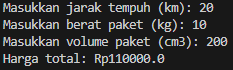
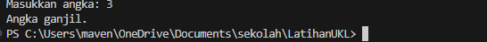
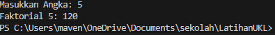
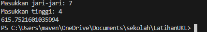
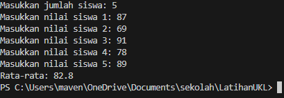
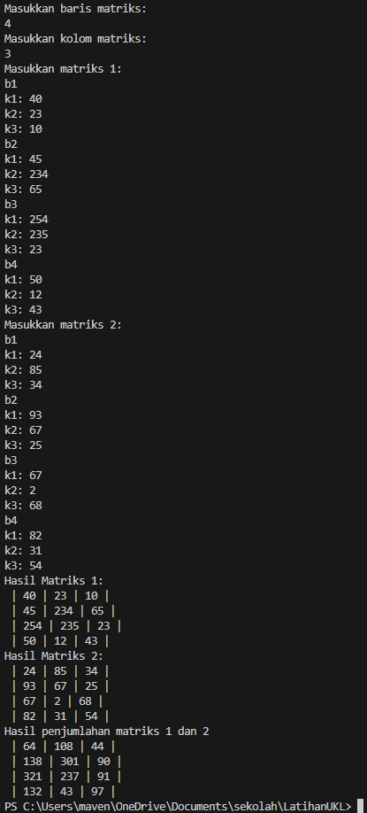

Objek Scanner digunakan untuk meminta input dari pengguna saat program dijalankan dan dideklarasi sebagai input.
 
Soal 1.1 
Deklarasi varibel harga, jarak, berat, dan volume dengan tipe data double. (b13) 
Meminta input jarak, berat, dan volume kepada pengguna menggunakan Scanner (variabel/objek bernama input) lalu disimpan untuk menentukan harga ke dalam variabel. (b14-b19) 
Jika jarak kurang dari sama dengan 10, maka varibel harga paket ditambah 4250 dikali berat paket, jika lebih dari 10 (selain <= 10) maka variabel harga ditambah 6000 dikali berat paket (If-else ini menggunakan ternary operator). (b20) 
Jika volume paket (cm3) lebih dari 100 maka variabel harga ditambah 50000, selain itu tidak ada penambahan. (b21) 
Menampilkan harga total setelah melakukan perhitungan. (b22) 
 

 
Soal 1.2 
Meminta input angka (int) kepada user. (b25-b26) 
Menentukan angka ganjil/genap biasanya menggunakan modulus (%) yaitu operator sisa hasil bagi, angka genap selalu habis dibagi 2. Jadi, jika variabel angka modulus 2 hasilnya 0 (sisa baginya 0) maka akan menampilkan "Angka genap.", selain kondisi tersebut menampilkan "Angka ganjil.". (b27-b31) 
 

 
Soal 2.1 
Meminta input angka (int) kepada user dan deklarasi varibel temp dengan nilai 1 (kedua variabel bertipe data int). (b34-b35) 
Menghitung faktorial menggunakan perulangan for-loop, for-loop tersebut memiliki variabel i dan bertambah 1 setiap perulangan dan berhenti ketika i > variabel angka, sederhananya, for loop ini mengulang sebanyak nilai varibel angka. (b36-b-38) 
Di dalam for-loop, jumlah temp baru diganti menjadi jumlah temp dikali variabel i (varibel temp-nya di-update). (b37) 
Menampilkan hasil faktorial. (b38) 
 

 
Soal 2.2 
Deklarasi variabel r dan t (jari-jari dan tinggi) bertipe data double, lalu pengguna memasukkan input untuk data varibel r dan t. (b42-b47) 
Deklarasi fungsi VTabung dengan parameter r dan t (double), di dalamnya terdapat rumus tabung yaitu pi dikali r kuadrat dikali tinggi (PI.r.r.t) yang kemudian haasilnya di-return/dikembalikan nilainya. Math.PI maksudnya menggunakan nilai Pi dari library/objek Math (bawaan dari Java) (b83-b85) 
Menampilkan hasil menggunakan Sout yang di dalamnya ada panggilan fungsi VTabung beserta parameter yang diisi dengan variabel r dan t yang nilainya berasal dari input pengguna. (b47) 
 

 
Soal 3.1 
Deklarasi variabel siswa (jumlah siswa), nilai (total nilai) bertipe data int, dan rata-rata bertipe data double. (b50) 
Meminta input jumlah siswa kepada pengguna. (b52-b53) 
For-loop yang mengulang sebanyak jumlah siswa (dari input) yang di dalamnya terdapat input untuk memasukkan nilai siswa. For-loop ini digunakan untuk meminta input nilai setiap siswa. (b54-b57)
Menghitung rata-rata, tipe data nilai/siswa di-casting menjadi double supaya menghasilkan hasil desimal. (b58) 
Menampilkan hasil rata-rata nilai siswa. (b59) 
 

 
Soal 3.2 
Deklarasi variabel baris dan kolom (int) meminta inputnya kepada pengguna. Matriks yang dibuat ini berbentuk tabel, semua matriks memiliki baris dan kolom yang sama. (b62-b66) 
Meminta input matriks 1 dan matriks 2 kepada pengguna dengan memanggil fungsi bernama matrix yang nanti menghasilkan multidimensional array (). Matriks ini menggunakan multidimensional array bertipe data int. (b68-b71) 
Menampilkan matriks berbentuk tabel menggunakan fungsi yang bernama disp, karena tampilan 2 matriks tersebut tidak seperti tabel, melainkan multidimensional array biasa yang mungkin lebih sulit untuk dibaca. (b73-b76) 
Deklarasi variabel newMat (int[][]) dengan fungsi count (bukan count bawaan) yang menghasilkan nilai dari penjumlahan matriks1 dan matriks2, lalu menampilkan matriks newMat dengan fungsi disp. (b78-b80) 
 
Penjelasan fungsi-fungsi soal 3.2:
1) matrix 
Fungsi ini menggunakan 2 parameter yaitu r dan k (baris dan kolom) dan akan return nilai berbentuk int[][]. (b88) 
Deklarasi input (Scanner), num (int) yang nanti digunakan sebagai nilai input, res sebagai hasil matriks (bukan penjumlahan) berbentuk int[][] yang jumlah array pertama dan keduanya sama dengan jumlah baris dan kolom yang berasal dari input pengguna (int\[pertama sebagai baris][kedua sebagai kolom]). (b89-b91) 
For-loop pertama berisi tulisan urutan baris dan for-loop kedua, kemudian for-loop kedua berisi tulisan urutan kolom dan mengganti setiap nilai dalam kolom res menggunakan input dari pengguna, setelah kolom pada baris tersebut semuanya diganti, maka akan pindah ke baris lain secara urut (sesuai nilai iterasi loop pertama). Urutan mengganti: baris -> kolom (hingga jumlah kolom) -> ulang (hingga jumlah baris). (b92-b99) 
Return hasil matriks. (b100) 
2) disp 
Fungsi ini menggunakan parameter mat sebagai matriks (int[][]), dengan return type int[][]. (b102)  
For-loop pertama berisi for-loop kedua. For-loop pertama digunakan untuk membuat baris baru (menggunakan println) setelah semua kolom ditulis pada baris ke-i (menggunakan print). 'i' adalah iterasi loop pertama yang bernilai urutan baris. (b103-b-109) 
3) count 
Fungsi ini menggunakan parameter m1 dan m2 sebagai matriks (int[][]), r dan c sebagai jumlah baris dan kolom. (b111) 
Deklarasi variabel res (int[][]) dengan jumlah baris dan kolom yang sama dengan baris dan kolom dari input pengguna. (b112) 
For-loop pertama hanya berisi for-loop kedua, karena for-loop pertama hanya digunakan untuk menghitung urutan baris. For-loop kedua digunakan untuk mengganti nilai res dan menghitung setiap nilai kolom pada setiap baris dengan nilai matriks1 dan matriks2 urutan ke-n (m dan res\[baris ke-i][kolom ke-p]). (b113-b-117) 
Return hasil matriks. (b1118) 

